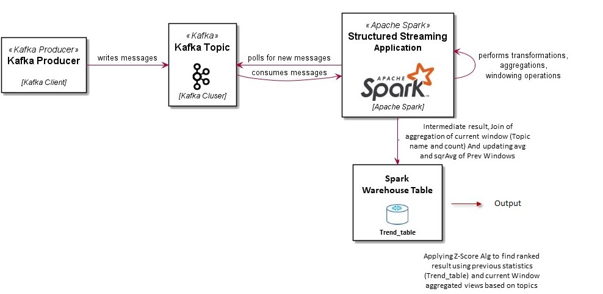

# Finding Hot Topics - Spark Streaming, Python and Kafka

## Context
Which Meetups should we go to?
We possess a sample JSON file that contains one RSVP 'message' on each line. Given the vast number of meetups occurring daily, staying updated on popular topics can be challenging. In this project, we've developed a scalable solution designed to identify trending topics within Meetup data.
The algorithm implemented for identifying trending topics is based on the Z-Score. This statistical measure, known as the Z-Score, helps us assess how each topic's popularity compares to the overall distribution of topic engagement. It allows us to determine whether a topic is significantly more or less popular than expected by chance.

As the algorithm progresses, intermediate results from each batch are stored in the Spark warehouse in Parquet file format. This storage approach ensures that we have a record of each batch's outcomes, enabling us to track topic trends over time and perform further analysis or visualization as needed.

## Datasets

Each row in the data set will be like:


```json
{
  "venue": {
    "venue_name": "Brisbane Workers\u2019 Community Centre",
    "lon": 153.002182,
    "lat": -27.46052,
    "venue_id": 17770652
  },
  "visibility": "public",
  "response": "no",
  "guests": 0,
  "member": {
    "member_id": 221294483,
    "photo": "http:\/\/photos1.meetupstatic.com\/photos\/member\/e\/8\/0\/4\/thumb_263939396.jpeg",
    "member_name": "Jenny Lethbridge"
  },
  "rsvp_id": 1658874890,
  "mtime": 1489923634000,
  "event": {
    "event_name": "Guest Presenter: Valerie Perret - Wellness facilitator and Self-Care Afficionado",
    "event_id": "238486635",
    "time": 1491525000000,
    "event_url": "https:\/\/www.meetup.com\/DreamBuilders-Brisbane\/events\/238486635\/"
  },
  "group": {
    "group_topics": [
      {
        "urlkey": "metaphysics",
        "topic_name": "Metaphysics"
      },
      {
        "urlkey": "consciousness",
        "topic_name": "Consciousness"
      },
      {
        "urlkey": "lifetransform",
        "topic_name": "Life Transformation"
      },
      {
        "urlkey": "self-esteem-self-confidence-boundaries-limits",
        "topic_name": "Self Esteem Self Confidence Boundaries & Limits"
      },
      {
        "urlkey": "self-help-self-improvement",
        "topic_name": "Self Help & Self Improvement"
      }
    ],
    "group_city": "Brisbane",
    "group_country": "au",
    "group_id": 19966923,
    "group_name": "Expand Your Awareness & Unlock Your Dreams   Brisbane",
    "group_lon": 153.02,
    "group_urlname": "DreamBuilders-Brisbane",
    "group_lat": -27.46
  }
}
```


## Requirements

This is a **distributable** solution that can take a Meetup RSVP data on input, and outputs an ordered list of the top trending topics per day. trending define as the largest *rate* increase of occurrence during a particular time period. Trends quantify the *rate* of growth over a specified period over different time points. A growth trend can be measured over any period of time, such as a minute, hour or day.


# Solution

## Apache Kafka
Apache Kafka is very popular, simple, scalable, efficient, mature and stable. 

It is very important to be able to create queues in online processing systems to process events based on priorities. There are other choices for this, such as Redis and RabbitMQ. 


## Apache Spark

The solution begins by reading a JSON file from the resources directory and sending the JSON data to a Kafka topic line by line. Each line in the source file represents a single JSON event. Next, Spark Structured Streaming is initiated by creating a window on the Kafka topic, where it reads all the JSON records within the specified window duration. Afterward, all the necessary information is extracted from these JSON records, and the data is stored in a microbatch DataFrame within the Spark application's memory. In Spark, a DataFrame is essentially a distributed collection of data organized into named columns, similar in concept to a table in a relational database. This microbatch is then aggregated based on topic count and subsequently passed to the writeStream class for further computation using the trend ranking algorithm.
the pseudocode for ranking algorithm which is based on z-score is as follow:

### Ranking Algorithm (Modified Z-Score)

**If this is the first batch to be processed in Kafka:**
  - Calculate `avg` and `sqrAvg` for each row in the microbatch DF:
    - `avg` = topic_count
    - `sqrAvg` = topic_count^2
  - Save the microbatch DF in the `TrendTable` in the Spark warehouse.

**Otherwise:**
  - Retrieve `trend_table` from the database.
  - Perform a full outer join between `trend_table` and `microbatchDF`.
  - Update `avg` and `sqrAvg` in `trend_table` based on new observations in `microbatchDF`:
    - `avg` = avg * decay + topic_count * (1 - decay)
    - `sqrAvg` = sqrAvg * decay + (topic_count^2) * (1 - decay)
    - Overwrite the `trend_table` with the new `avg` and `sqrAvg` values in the database.
  - Compute `trendDF` based on the new `avg`, `sqrAvg`, and topic observations:
    - `topic_score` = (obs - avg) / std()
  - Compute the final ranked DF based on each topic score and show the result.

<p align="center">
  
</p>


## Version Compatibility

Python| Spark|Kafka     
--- | --- | ---
\>=3| >=3| 3.0.0

## Getting Started

Create the meetup topic in kafka and stary producer with blleow command:
```bash
python Producer
```
After producing meetup events, pyspark application could be run by bellow command:
```bash
python Main.py
```
### Prerequisites

Please ensure that you have the following prerequisites installed:

- Python 3 or higher
- Apache Spark 3 or higher
- Kafka 3.0.0
- An active internet connection to download the required Python and Spark libraries.


## Author

👤 **Samira Parvaniani**

- Github: [@SamiraParva](https://github.com/SamiraParva)

## Version History
* 0.1
    * Initial Release
